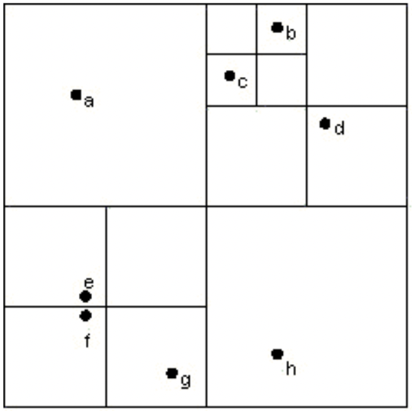
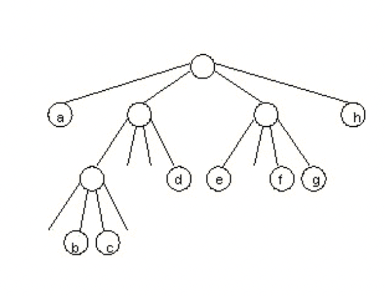
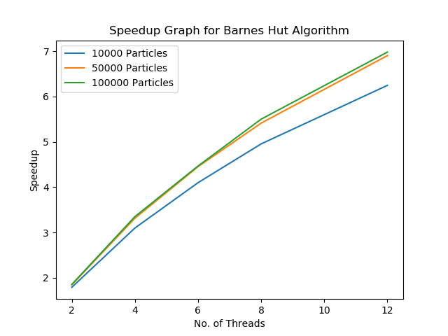
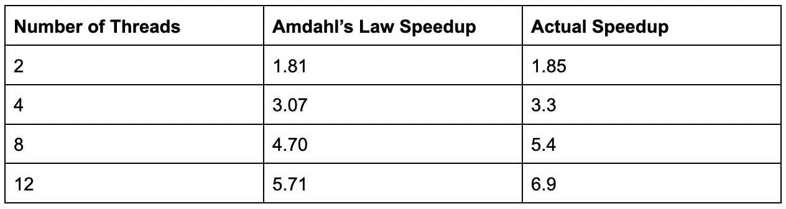

# BARNES-HUT ALGORITHM FOR N-BODY SIMULATION (PARALLEL IMPLEMENTATION)

### INSTRUCTIONS FOR RUNNING
1. Go to the `src/main/` directory.

2. Run `pip install -r requirements.txt` to install matplotlib for the `generate_graphs.py` and `space_graph.py`. You can run this in a python virtual environment as well.

3. Run `./benchmark_graph.sh` to generate the speedup graph and input and output particle position files. You don’t need to provide any argument if you are running the shell script.

4. If you want to run the Go code for Barnes-Hut algorithm, run `go run main.go` which will
run the code in sequential mode with defaults. You can give it the following arguments in
order: `go run main.go <num_of_particles> <num_of_threads> <num_of_iterations> <y/n for visual graph>`

    argv(1) = number of particles (optional)

    argv(2) = number of threads (needed for parallel run) (optional)

    argv(3) = number of iterations or time-steps (optional)
    
    argv(4) = y ->then the main.go runs space_graph.py which opens a realtime plot for the positions of the particles in 2-D space in each iteration (optional)

5. You can just give the `num_of_particles` and run it in sequential version, else you can also
specify the `num_of_threads` to run in parallel mode.
Running the shell script or the python code directly will generate the speedup graph, along with
`particles_input.dat` and `particles_output.dat` which are the input and output files for the run.
Since the program generates random particles based on the input arguments,
`particles_input.dat` contains the particles’ initial X and Y positions in space and the `particles_output.dat` contains the particles’ positions after 200 (or argv(3)) time-steps.

The speedup graphs do not use the visual mode as it slows the speedups with constant writes to `particles_output.dat` file for plotting in each iteration.

## PROJECT DESCRIPTION

Barnes Hut Algorithm is an approximation algorithm for N-Body simulation. N-Body simulation is a simulation of the system of particles under a force such as gravity. This project simulates the N-Body problem in 2-D space, calculating the position of particles (unit mass) in each time-step, where each particle experiences a net force from all the other particles in the space. 

N-Body simulation is a very important simulation in Physics, especially Astrophysics. The naive solution to the N-Body problem is of O(N^2) time complexity where we calculate the forces on each particle due to all the other particles in space.

Barnes Hut Algorithm is an approximation algorithm which solves the N-Body problem with `O(Nlog(N))` time complexity.

For visualization, the algorithm divides the 2-D space into quadrants using a `Quad Tree`, such that each quadrant at the smallest level only contains 1 particle, and each particle only needs to calculate the force of the particles in the nearby quadrants and approximate the force from the particles in distant quadrants using the center of mass of the larger quadrant containing those far-away particles. With a correct choice of `s/D` ratio (where `s` is the size of the quadrant and `D` is the distance of the particles from that quadrant) we can define what is a good choice for skipping individual particles and calculating the force using the center of mass of the quadrant. This improves the performance significantly while also giving a reasonable accuracy in force calculation.

The image below shows a representation of the Quad Tree built for Barnes Hut Algorithm, where each quadrant is a node and particles are present in the leaf nodes while the parent quadrants are the parent nodes.

Reference: https://www.cs.princeton.edu/courses/archive/fall03/cs126/assignments/barnes-hut.html

While calculating forces on the particles in the tree above, for example, let's say for particle `a`, we can define a `s/D` such that it might see that the quadrant to the right are too close and calculates the forces by individual particles `c`, `b` and `d`, but might find the quadrant below (containing `e`, `f` and `g`) to be too far and doesn’t traverse that parent quadrant further and calculates the force using the center of mass of the parent quadrant for these 3 particles which would be stored in the parent node of these particles, thus avoiding unnecessary extra traversals for trivial accuracy gains.

Here is a [link](https://en.wikipedia.org/wiki/Barnes%E2%80%93Hut_simulation) to the Wikipedia page explaining Barnes-Hut Algorithm if you are interested to learn more about it.

## PARALLEL IMPLEMENTATION
### Why Pipelining?

The solution for parallel implementation of Barnes-Hut Algorithm is `pipelining`. This is because the algorithm has multiple supersteps which are required to be completed sequentially. 

The most important reason being, that the other parallel implementations won’t inherently work for Barnes-Hut. `BSP` requires a chunk of inputs to be distributed to all the threads which can then work on them in parallel, but in Barnes-hut, we only have 1 input, i.e. the root node. We can’t distribute tasks initially to each thread, instead, all worker threads are initially idle, except the one thread with the root node as input. This is the case for all the supersteps in Barnes-Hut.

We also cannot use `Map-Reduce` because we can’t split the input tasks independently as each task input requires the whole tree for the superstep as we need to calculate the effect of all the particles on a single input particle. This limitation completely rules out Map Reduce as an option.

`Pipelining` is the best solution because Barnes-Hut has the following supersteps which are needed to be completed in order.

### Initialization - Tree Building
This implementation inserts particles into the tree sequentially. For inserting particles the code finds the quadrant (node in the tree) with the appropriate coordinate bound for the particle. If the particle already exists in the quadrant, it divides the quadrant into 4 sub-quadrants (4 children of the parent node), and inserts the existing and the new particle in the appropriate quadrant.

## SUPERSTEPS
### 1. Calculate Center of Mass (COM)
After insertion we calculate the center of mass of each quadrant and sub-quadrant of the tree in parallel. This is required before we can start with the force calculation step. The calculation of the center of mass is the most complex step to parallelize compared to the other two supersteps. This is because the parent node cannot calculate its center of mass before its children have calculated their centers of mass.

Because of this limitation, it becomes extremely complicated to implement this superstep using work stealing, so for parallelizing this step, each thread working on the parent node, either creates a new go routine for the child node and awaits its completion or if the maximum number of threads allowed is reached, it sequentially works and recursively travels the child nodes and calculates their centers of mass. As the threads complete their tasks, they decrement the activeThread counter atomically, which indicates to the other threads working sequentially that they can now start parallelizing their tasks. Technically, it dynamically changes the granularity of the tasks based on the active threads.

This implementation is very efficient and ensures that all the threads are utilized and no thread remains idle and doesn’t have to wait for threads to be available before its children’s COMS are calculated.
### 2. Calculate Velocity
After calculating the COMs for all quadrants in the tree, we calculate the velocity of all the particles in the tree due to the forces by all the other particles. We do this using work stealing.

#### Important Note on Work Stealing:-

Work Stealing is not the best solution for parallelizing Barnes Hut because we only have 1 input (root node) initially, so the other threads start off by stealing work, which is extremely slow due to the contentions in the deque. Ideally, work stealing performs well when we have a good chunk of tasks distributed amongst the threads and when the threads are done with their tasks, that's when they start stealing. Here, they steal from the beginning as there is only 1 input to begin with

A better and much easier implementation would use channels but to make it more interesting I have used work stealing to introduce a different concept to this project.

Now, coming back to how velocity is calculated. 

### Work Stealing
The code uses a linked list implementation of `Deque` (Doubly Ended Queue) for storing the inputs to each thread. The code starts by spawning worker threads based on the number of threads passed as inputs and then assigning just 1 input, the root node, to the first thread, while all the other threads start idle with 0 inputs.

Now the thread checks the node for children and pushes it to its deque. The other threads start by stealing these children nodes and processing them.

The threads check if the node has a particle or if it is a parent quadrant. If it’s a parent it skips and pushes its children to the deque.

If the node has a particle, it calculates the force on that particle due to all the other particles in the tree by recursively travelling the tree, and avoiding traversal wherever the COM can be used for Force Calculation.

After calculating the force, it updates the velocity of the particle in the X and Y direction and stores it in the Particle object (there is a data member for this in the Particle struct).

As the nodes are traversed and processed by each thread, they create more and more inputs (child nodes) and push them to their respective deques, thus reducing the frequency of work stealing.

As their tasks get empty, they check for tasks from each of the other deques constantly until all the tasks are processed, which is tracked using an atomic variable which keeps a count of the particles processed till now.

### 3. Update Positions

After calculating the velocity of the particles, we calculate the new positions of the particles in the `2-D space` after a `time-step`, which is a small duration of time (`dt` variable in `main()`).

This step also uses work stealing, for distribution of tasks. It is exactly the same as calculating the forces, but the work it does is updating the X and Y positions of the particles due to the velocity after the time-step.

## Reinitialization - Tree Building
Then the tree is built again using the new positions as the particles in their new positions might have to be assigned to different quadrants. This is done sequentially.
## Challenges
### 1. Recursive Functions
The biggest challenge was parallelizing the recursive functions. Since we only have 1 node to start with (the root node), it is difficult to come up with an efficient parallel solution, especially with work stealing. 

Functions such as Calculation of Centers of Mass, made it even more difficult to think of a parallel solution as each parent node was dependent on the child node to be completed first before it could calculate its center of mass. The recursive sequential function is easy to implement but parallelizing it required a creative solution which didn’t keep threads idle while the parent waited. This is solved by using a model which spawns a worker for each recursion and waits for it to return, but if the max number of threads are already spawned, each thread recurs sequentially to calculate the COMs of its children.
### 2. Parallelization on Tree data structure.
An important aspect of my learning on this project was parallelizing the tree data structure, which is at first easy to think but becomes extremely complex while implementing.

### 3. Tree Building Step
The tree building step can be done in parallel but requires a concurrent implementation of the Barnes Hut tree. Due to the timeline of the project, I didn’t parallelize the Tree building step.
### Effect of Work Stealing
In my particular implementation work stealing reduces performance for small numbers of particles, but as we increase the number of particles the difference in speedup reduces. 

This is because work stealing is not the best approach for Barnes-Hut algorithm as we only have 1 input. As specified in the important note above, work stealing works best if we distribute a chunk of tasks to different threads and then when the threads are done with their tasks, they steal work from other threads thus, optimizing performance and reducing idle time. 

In the case of Barnes-Hut, we start with 1 task, the root node. So, only 1 thread has a task initially and all the other threads are idle. Now, as the thread with the task pushes more tasks in its deque, that's when the idle threads start stealing tasks and pushing new tasks to their own queue. Since initially a lot of stealing is done, this reduces the performance as there is a lot of contention in the deque, until all the threads have enough tasks such that they don’t need to steal until their tasks are over.

But, with a large number of particles, the number of tasks created increases by 4^n in n levels of the quadrant. So, the effect of the contention is insignificant as the tasks increase and all the threads perform the processes in parallel.

## SPEEDUP ANALYSIS
### HOTSPOTS
### 1. Calculation of Center of Mass (COM)
Center of mass for each particle can be calculated in parallel. If done sequentially, the full tree is traversed sequentially when calculating the COMs.

The code parallelizes this step by calculating the COMs, in parallel for each quadrant. It creates worker threads which traverse the tree, first calculating the child node’s COM and then returning to the parent node. 

### 2. Calculation of the Velocity
Similar to the COM calculation, the velocity calculation is also done in parallel using work stealing. It's the same process as COM calculation but instead calculates the velocity of each particles due to the forces from all the other particles.

The parallel implementation is exactly similar to COM calculation.

### 3. Tree insertion
The tree insertion is a major hotspot as we have to do tree reinsertion after each time-step. This is a major sequential bottleneck. I have not implemented the tree insertion in parallel due the complexity and the time required. It requires building the tree with locks and creating sub trees and merging them. Currently this is done sequentially.

### BOTTLENECKS
### 1. Supersteps
The supersteps have to be done sequentially as each step is dependent on the previous one. We can’t calculate the Center of Mass before inserting the particles in the correct quadrant. Then, we can’t calculate the velocity before calculating the centers of mass for each quadrant as we require it for the approximation step. Then we can’t calculate the position without knowing the velocity of the particles. So, all these steps need to be done sequentially.
### 2. Calculation Functions
The calculations of the velocity or forces or positions have to be done sequentially as they are mathematical sequential functions.
### 3. Iterations or Time-Steps
The positions are updated 200 times by default in this implementation. These 200 iterations of position updation of the system of particles needs to be done sequentially as we need to calculate the previous position before starting with the force calculation of the next position.
### 4. Dequeu for work stealing
The deque for work stealing is implemented using a Linked List. It requires locks which creates a lot of contention initially when the threads are stealing tasks for task generation and later on when the threads are stealing tasks since they are idle.
## SPEEDUP GRAPH AND CALCULATION

Using CPU Profiling we can calculate the expected speedup using Amdahl’s Law,

It is slightly complex to analyze the CPU profiling to find what percent of the code which we parallelize since Barnes-Hut runs multiple iterations to update the positions across multiple time-steps. This graph is for 200 iterations.

But, we can see from the profiling the calcVelocity uses around 80% of the CPU while position updates and reinsertion use somewhere around 10%.

Since the profiling was run with 200 iterations as well, it's safe to assume that the parallel portion of the program is around 90%.

So, taking P = 0.9 and S = 0.1, using Amdahl’s law we get the following comparison for speedup. Amdahl’s Law: Speedup = 1/(S + P/N), where N is the number of threads.

The speedups are very close, in fact, better than the Amdahl’s speedup. The reason for such a speedup is due to the large fraction of the algorithm being parallelizable. It is very interesting to see the algorithm be parallelizable.

Barnes-Hut is a great algorithm for parallelizing but it is very challenging to create a solution for a parallel implementation due to the recursive nature of the algorithm.

This is an expected result as the iterations occur in parallel and are a major bottleneck but the speedup is good because each heavy task like  Force and Velocity Calculation and position updates are done in parallel. So each iteration completes extremely fast compared to the sequential version. 

Also the Velocity calculation is a major hotspot as it constitutes almost 80% of the CPU, vastly greater than any of the other functions, and the implementation fully parallelizes it using work stealing.

Also, one factor to keep in mind is that, since it requires sequential time-step iterations, the approximation of the parallel fraction of the implementation could by slightly off for Amdahl’s Law speedup calculation. This could also be a potential reason for the slight difference in speedup.

The parallel implementation can also perform better than Amdahl’s due to the parallel implementation of the COM calculation which doesn’t let the threads sit idle and dynamically increases the granularity of the work based on the active threads. This allows all the threads to remain active until the function returns as the threads recursively call the child nodes instead of assigning it as a task to another thread if the active threads has already reached the maximum allowed threads.

The idle time reduces with work stealing as well. Although work stealing starts as a bottleneck because of the tree structure and its recursive nature, as we only have 1 task initially, as the number of tasks increase exponentially, we have more parallel tasks distributed and towards the end when threads finish their tasks, they again get to work stealing to avoid staying idle. This optimizes the performances further.